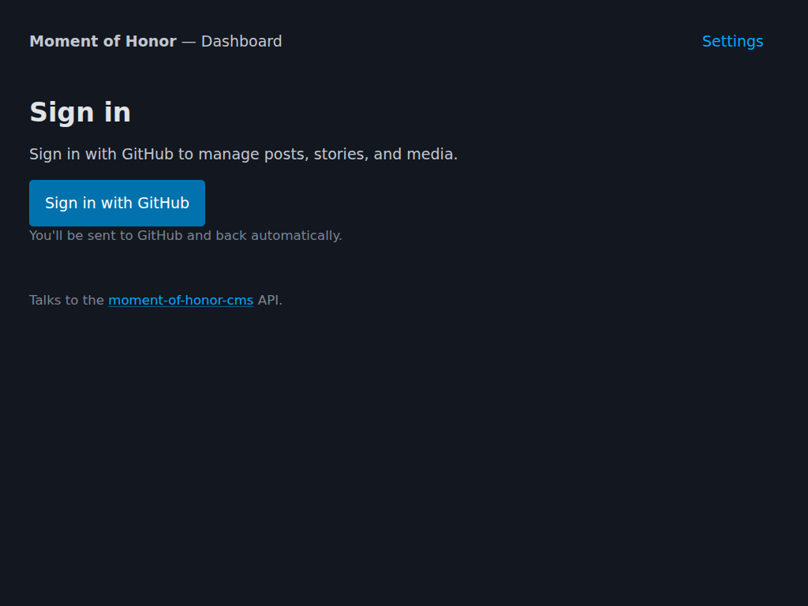
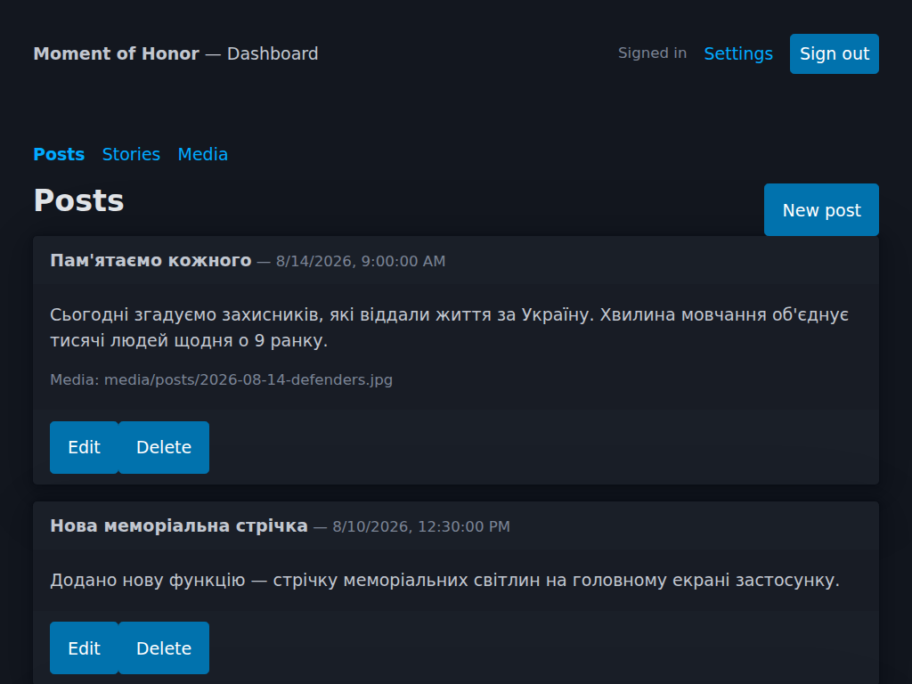
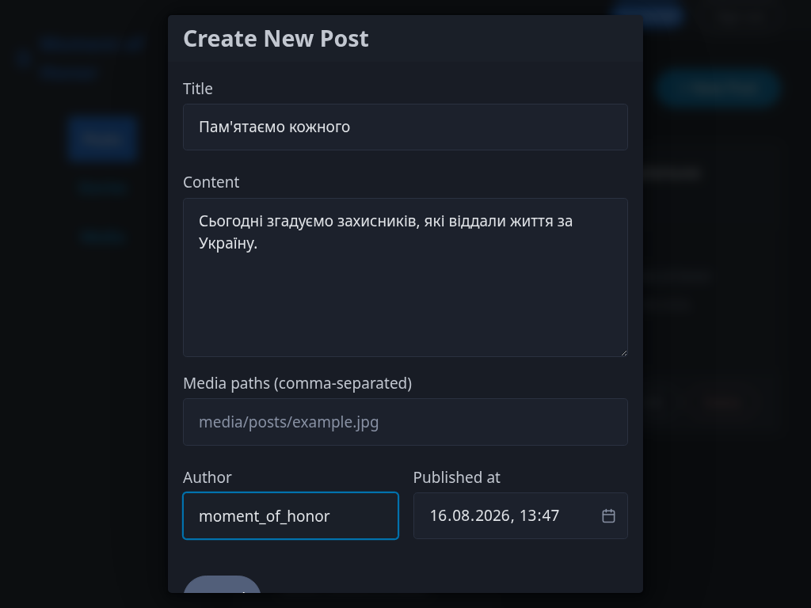
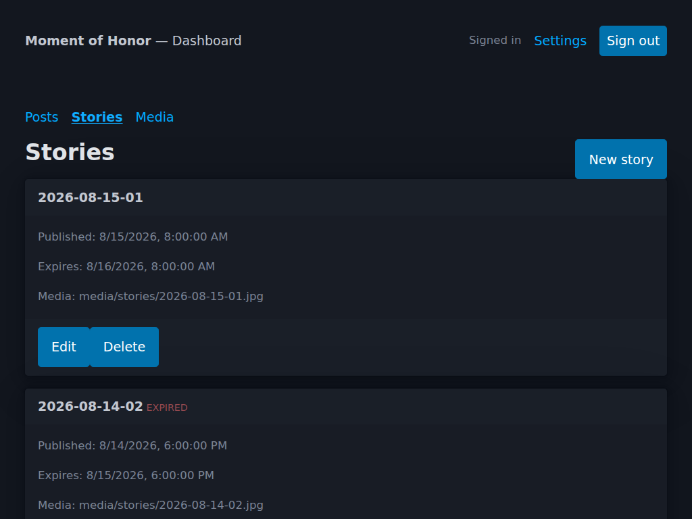

# Moment of Honor Dashboard

A small author-facing dashboard for the [`moment-of-honor-cms`](https://github.com/ChernegaSergiy/moment-of-honor-cms) API: sign in with GitHub, create/edit/delete posts and stories, and upload media.

The CMS API is intentionally UI-less — it's a serverless backend, not a product. This repository is a from-scratch, single-purpose client for it.

- **Svelte + Vite.** Built as a fast, modern Single Page Application using Svelte.
- **[Pico CSS](https://picocss.com) (classless build).** Semantic HTML is styled automatically; there's no utility classes to maintain for a UI this small.
- **[Cloudflare Pages](https://pages.cloudflare.com).** Deploys as a static site, matching how `moment-of-honor-cms` already runs on Cloudflare Workers.

## Screenshots

| Sign In | Posts |
| :---: | :---: |
|  |  |
| **New Post** | **Stories** |
|  |  |

## Deploy

[](https://deploy.workers.cloudflare.com/?url=https://github.com/ChernegaSergiy/moment-of-honor-dashboard)

When deploying manually to Cloudflare Pages, use the following settings:
- **Framework preset:** `Vite` (or `None`)
- **Build command:** `npm run build`
- **Build output directory:** `dist`

Configuration (the CMS API URL) happens once, in the browser, on first load.

## Cross-origin setup (Worker configuration)

The dashboard and `moment-of-honor-cms` normally run on different origins (e.g. `*.pages.dev` and `*.workers.dev`), so this is a cross-origin setup. `moment-of-honor-cms` supports this directly — see its README's ["Cross-origin clients (CORS)"](https://github.com/ChernegaSergiy/moment-of-honor-cms#cross-origin-clients-cors) section — as long as the Worker is configured to allow it:

1. Deploy this dashboard and note its URL (e.g. `https://moment-of-honor-dashboard.pages.dev`).
2. In `moment-of-honor-cms`'s `wrangler.toml`, add that origin to `ALLOWED_ORIGINS` (comma-separated if there's more than one, e.g. a custom domain and a `*.pages.dev` preview URL).
3. Redeploy the Worker.
4. Set the dashboard's API base URL (in Settings) to the Worker's URL.

Without this, sign-in and every API call will fail outright — the Worker won't send `Access-Control-Allow-Origin` for an origin it doesn't recognize, and the browser blocks the request. The dashboard detects a cross-origin API URL and reminds you to check `ALLOWED_ORIGINS` in Settings, so this isn't a silent failure.

## Using the dashboard

1. Open the deployed site. On first load you're asked for the CMS API base URL — the Worker's `*.workers.dev` URL or custom domain, once its `ALLOWED_ORIGINS` includes this dashboard's origin (see above).
2. Click **Sign in with GitHub**. You're sent to GitHub's consent screen and back automatically — no popup, no manual step.
3. Use the **Posts**, **Stories**, and **Media** tabs to manage content. Uploading media returns a repository path (e.g. `media/posts/…`); copy it into the `Media paths` field of a post or story.

All writes go through the CMS API exactly as documented in its README — this dashboard has no direct GitHub access of its own.

## Project layout

```text
moment-of-honor-dashboard/
+-- index.html      # Vite entry point
+-- vite.config.js  # Vite configuration
+-- package.json    # Dependencies and build scripts
\-- src/
    +-- main.js       # App entry (mounts Svelte and loads PicoCSS)
    +-- App.svelte    # Main shell: settings, sign-in, tabs, status banner
    \-- lib/
        +-- api.js    # API Client wrapper
        +-- auth.js   # Auth/session logic
        +-- config.js # LocalStorage configuration for API URL
        +-- media.js  # Media upload and clipboard utilities
        +-- style.css # PicoCSS overrides
        +-- Posts.svelte   # Posts tab and creation modal
        +-- Stories.svelte # Stories tab and creation modal
        \-- Media.svelte   # Media tab and upload form
```

## Local development

To run the dashboard locally:

```bash
# Install dependencies
npm install

# Start the Vite development server
npm run dev
```

Then open `http://localhost:5173` and point Settings at your Worker's `*.workers.dev` URL or local `wrangler dev` address. Cross-origin limitations from the section above still apply.

## Contributing

Contributions are welcome and appreciated! Here's how you can contribute:

1. Fork the project
2. Create your feature branch (`git checkout -b feature/AmazingFeature`)
3. Commit your changes (`git commit -m 'Add some AmazingFeature'`)
4. Push to the branch (`git push origin feature/AmazingFeature`)
5. Open a Pull Request

Please make sure to update tests as appropriate and adhere to the existing coding style.

## License

This project is licensed under the CSSM Unlimited License v2.0 (CSSM-ULv2). See the [LICENSE](LICENSE) file for details.
